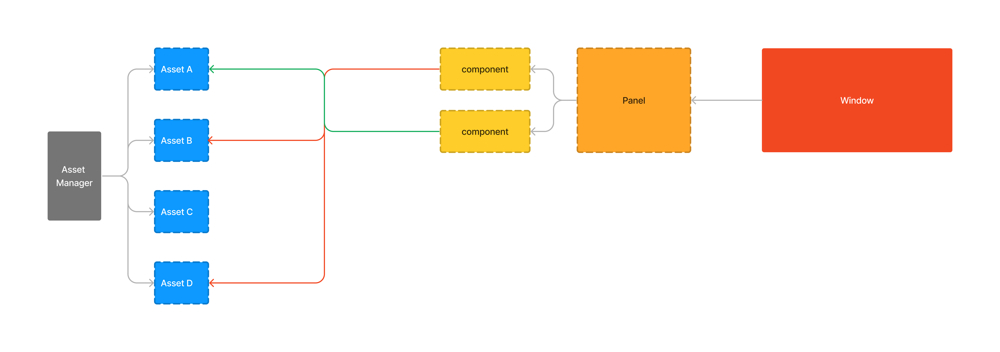

### Graphics
Graphics is a thin wrapper around `Tigr`. The library consists of 6 components all interracting with each other 

#### Asset
Asset represent the bare minimun of a graphical element. It holds an `id` and a `Tigr *` (the bitmap for all intent and purposes). Assets are managed by the `Asset Manager` who's responsible to hand them over as requested.

#### Asset Manager
The `Asset Manager` is a simple vector holding all the `Asset`s needed for a window to be drawn. It responsible to allocate a space for them, destroy them and hand them over to other components per request

#### Component
A `Component` is the smallest element capabale of holding `Asset`s. All the `Asset`s it holds will be drawn on top of one another

#### Panel
A `Panel` is an element which contains multiple `Component`s. It also has its own bitmap. All of the `Component`s it hold will be drawn on said bitmap

#### Window
`Window` represent a window. It may hold multiple `Panel`s and has its own bitmap. all the visible `Panel`s will be drawn on said bitmap
